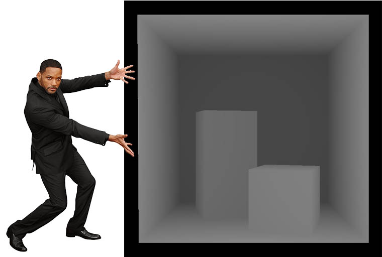

# PG-raytracer

Tento repozitář obsahuje semestrální práci pro předmět NI-PG1 z FITu.

Cílem této práce je vytvořit renderer s datovou strukturou, která bude teprve upřesněna.
Pro správné fungování bude nutné dorozbalit scény, které se nachází ve složce tislijan\raytraycer\scenes\

Následují ukázky z postupného vytváření celého rendereru v jednotlivých krocích. Hloubkový test, načítání scény a boxy, následně základní barva, výpočet osvětlení a stínů a nakonec odraz a lom. Tabulka pod obrázky znázorňuje naměřené časy pro různé konfigurace. 

<\p>

<\p>

<\p>

| Scéna | # vláken | # paprsku | čas (s) | BVH |
|-------|----------|-----------|---------|-----|
|CornellBox-Original|1|1|~0.590| |
|CornellBox-Original|31|1|~0.052| |
|CornellBox-Original|1|32|~12.993| |
|CornellBox-Original|31|32|~0.809| |
|CornellBox-Original|1|1|~0.800|x|
|CornellBox-Original|31|1|~0.080|x|
|CornellBox-Original|1|32|~17.040|x|
|CornellBox-Original|31|32|~1.126|x|
|CornellBox-Sphere|1|1|~28.644| |
|CornellBox-Sphere|31|1|~2.234| |
|CornellBox-Sphere|1|32|~594.968| |
|CornellBox-Sphere|31|32|~45.394| |
|CornellBox-Sphere|1|1|~5.624|x|
|CornellBox-Sphere|31|1|~90.135|x|
|CornellBox-Sphere|1|32|~0.530|x|
|CornellBox-Sphere|31|32|~7.853|x|

Testovací stroj:
 - Ryzen 9 3950x, 16 jader, 32 vláken, 3500MHz až 4700MHz

### Úkoly

 - [x] Vytvořit ray tracer
 - [x] Vytvořit načítání scén a materiálů
 - [x] Refactor - I
 - [x] Průsečíky trojúhelníků
 - [x] Ověření funkčnosti načítání
 - [x] Osvětlovací model, materiály, Phong, stíny
 - [x] Ověření funkčnosti osvětlení ve scénách
 - [x] Plošné zdroje světla
 - [x] Odražené / lomené paprsky
 - [x] Ověřit funkčnost 
 - [x] Získat výsledek dle ukázek
 - [x] Výběr Datové struktury
 - [x] Měření rychlostí DS a bez ní
 - [x] Frenel efekt
 - [x] Závěrečná zpráva